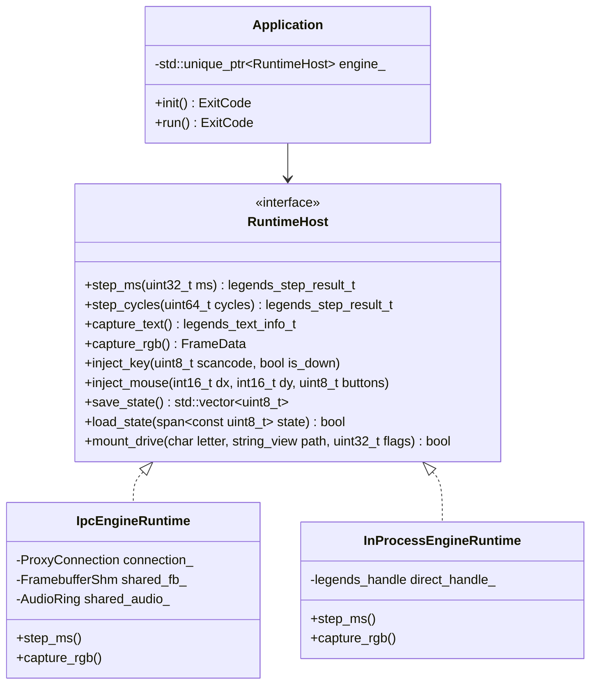
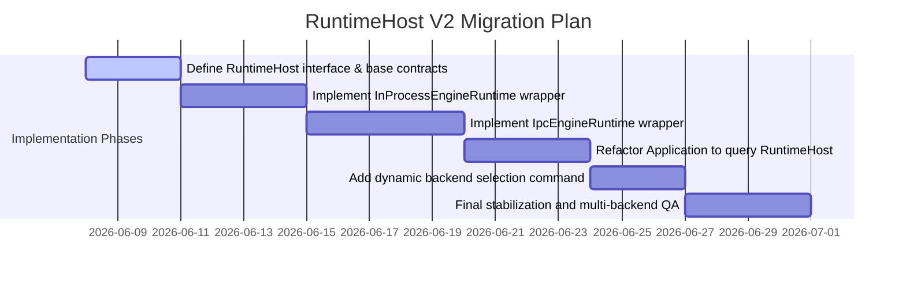

# RuntimeHost V2 Design: Dual-Backend Architecture for ProjectLegends

## 1. Executive Summary

This document describes the design for the **RuntimeHost V2** architecture. The goal of this architecture is to provide a clean, unified C++ interface (`RuntimeHost`) that abstracts the emulation backend of ProjectLegends.

By introducing this abstraction, ProjectLegends will natively support a dual-backend model:
1. **`IpcEngineRuntime` (Process-isolated)**: The intended default production target. Runs the emulation engine in a separate process (`legends_engine_host`) to provide crash containment and a clearer licensing boundary for review. This document is an engineering design, not a legal conclusion that the boundary is sufficient for GPL compliance.
2. **`InProcessEngineRuntime` (In-process)**: A high-performance, deterministic developer/testing backend. It links the engine core directly into the host process, enabling low-overhead debugging, profiling, and deterministic unit/integration testing.

---

## 2. Architecture & Class Design

The core of the V2 architecture is the `RuntimeHost` interface, which defines the complete contract required by the front-end `Application` shell.

### 2.1 Class Diagram



---

## 3. Runtime Backends

### 3.1 `IpcEngineRuntime` (Production Default)
* **Description**: Spawns `legends_engine_host` as a child process and communicates across the process boundary using local IPC sockets/pipes for command control and shared memory for high-bandwidth framebuffer and audio streams.
* **Current Gap**: The existing IPC code is not yet a complete product runtime. The proxy can create shared memory, but `legends_engine_host` does not currently open/write the framebuffer or audio shared-memory regions, and many public C ABI functions still return `LEGENDS_ERR_NOT_SUPPORTED` in `src/legends_proxy/proxy_api.cpp`.
* **Source Files**:
  - Host process entrypoint: [main.cpp](file:///C:/Users/charl/ProjectLegends/src/engine_host/main.cpp)
  - Message handling: [engine_dispatcher.cpp](file:///C:/Users/charl/ProjectLegends/src/engine_host/engine_dispatcher.cpp)
  - Proxy client side: [proxy_api.cpp](file:///C:/Users/charl/ProjectLegends/src/legends_proxy/proxy_api.cpp), [proxy_connection.cpp](file:///C:/Users/charl/ProjectLegends/src/legends_proxy/proxy_connection.cpp)
  - IPC structures: [audio_ring.h](file:///C:/Users/charl/ProjectLegends/include/legends_ipc/audio_ring.h), [framebuffer_shm.h](file:///C:/Users/charl/ProjectLegends/include/legends_ipc/framebuffer_shm.h)

### 3.2 `InProcessEngineRuntime` (Developer / Test Backend)
* **Description**: Runs the emulation engine directly within the host process thread. Offers zero-overhead memory access, perfect deterministic timing alignment, and works with standard IDE debuggers without process boundary hops.
* **Source Files**:
  - Direct embedding API: [legends_embed_api.cpp](file:///C:/Users/charl/ProjectLegends/src/legends/legends_embed_api.cpp)
  - App controller: [application.cpp](file:///C:/Users/charl/ProjectLegends/src/app/application.cpp)

---

## 4. Module Boundaries & Ownership

```
+-------------------------------------------------------------------------------+
|                           Application Shell (C++23)                           |
|       - Renders UI (MapperUI, AIPanel)                                        |
|       - Directs audio output via PAL (audio_sink_)                            |
|       - References only RuntimeHost interface                                 |
+-------------------------------------------------------------------------------+
                                        |
                                        | [RuntimeHost Interface]
                                        v
                       +---------------------------------+
                       |     Dynamic Runtime Factory     |
                       +---------------------------------+
                          /                           \
                         / (Default Production)        \ (Dev / Test)
                        v                               v
+-------------------------------+               +-------------------------------+
|      IpcEngineRuntime         |               |    InProcessEngineRuntime     |
|  - Communicates via proxy     |               |  - Monolithically linked      |
|  - Process isolated           |               |  - Deterministic step execution|
+-------------------------------+               +-------------------------------+
                | (IPC Socket / SHM)                            | (C ABI Direct calls)
                v                                               v
+-------------------------------+               +-------------------------------+
|      legends_engine_host      |               |         legends_core          |
|  - GPL-2.0 Emulation Engine   |               |  - Monolithic Emulation Core  |
+-------------------------------+               +-------------------------------+
```

---

## 5. Migration & Integration Phases



---

## 6. Acceptance & Equivalence Testing

To guarantee that the two runtimes behave identically from the application perspective, the following test coverage will be verified:
1. **API Equivalence Contract**: Enable and run [test_ipc_integration.cpp](file:///C:/Users/charl/ProjectLegends/tests/integration/test_ipc_integration.cpp), which is currently disabled, to verify that commands sent through `IpcEngineRuntime` match direct FFI calls made on `InProcessEngineRuntime`.
2. **Determinism Parity**: Running deterministic tests like [test_load_state_atomicity.cpp](file:///C:/Users/charl/ProjectLegends/tests/integration/test_load_state_atomicity.cpp) under both runtimes and checking that state hashes match cycle-for-cycle.
3. **Shared Memory Benchmarks**: Running [bench_ipc_overhead.cpp](file:///C:/Users/charl/ProjectLegends/benchmarks/bench_ipc_overhead.cpp) to verify that frame transfer overhead remains below 2ms per frame.

---

## 7. Current Implementation State and Gaps (Sprint 2 Handoff)

### 7.1 Implemented State
During this sprint, the RuntimeHost V2 dual-backend foundation was implemented:
- **`RuntimeHost` Abstract Interface**: Added [runtime_host.h](file:///C:/Users/charl/ProjectLegends/include/legends/runtime_host.h) and its implementations in [runtime_host.cpp](file:///C:/Users/charl/ProjectLegends/src/app/runtime_host.cpp). It defines the first compilable boundary between direct (in-process) and IPC (out-of-process) runtime behaviors.
- **Proxy Dispatcher Hardening**: Added dispatch cases for `MountDriveReq` and `UnmountDriveReq` inside [engine_dispatcher.cpp](file:///C:/Users/charl/ProjectLegends/src/engine_host/engine_dispatcher.cpp) to map incoming IPC requests to `legends_mount_drive` and `legends_unmount_drive` respectively.
- **Capability Matrix Verification**: Changed the proxy status of `legends_mount_drive` and `legends_unmount_drive` to `proxy-supported` in [capability_truth.json](file:///C:/Users/charl/ProjectLegends/docs/architecture/capability_truth.json) and [2026-06-08-public-capability-truth-matrix.md](file:///C:/Users/charl/ProjectLegends/docs/architecture/2026-06-08-public-capability-truth-matrix.md). Verification scripts pass successfully.
- **IPC Build Repair**: Codex audit found and fixed IPC preset compilation blockers caused by ignored `[[nodiscard]]` send/wait results in [main.cpp](file:///C:/Users/charl/ProjectLegends/src/engine_host/main.cpp) and [test_ipc_integration.cpp](file:///C:/Users/charl/ProjectLegends/tests/integration/test_ipc_integration.cpp).

### 7.1.1 Current RuntimeHost Caveats
- The front-end [application.cpp](file:///C:/Users/charl/ProjectLegends/src/app/application.cpp) still stores `legends_handle` directly and calls `legends_*` APIs throughout. RuntimeHost adoption by the application remains future work.
- `IpcEngineRuntime` currently forwards through the linked `legends_*` C ABI. It does not yet own engine-host spawning, proxy connection setup, or shared-memory lifecycle.
- `cmake --preset ipc` requires Ninja, Clang, and `llvm-rc` to be discoverable or passed explicitly in this Windows shell.

### 7.2 Remaining Proxy Gaps
Following this sprint, there are 17 proxy-supported APIs, 3 proxy-partial APIs, and 30 proxy-missing APIs:

#### 7.2.1 Proxy-Partial Gaps (3 APIs)
1. `legends_capture_rgb`: The proxy reads framebuffer from shared memory, but the engine host does not yet open or write to this region.
2. `legends_capture_audio`: The proxy reads audio from shared memory, but the engine host does not yet open or write to the audio ring buffer.
3. `legends_key_event_ext`: The proxy currently aliases this directly to `legends_key_event`, meaning extended scancode (E0) keypress data is not represented in the IPC wire format.

#### 7.2.2 Proxy-Missing Gaps (30 APIs)
These APIs currently return `LEGENDS_ERR_NOT_SUPPORTED` directly on the proxy side:
1. `legends_get_config`
2. `legends_capture_text`
3. `legends_text_input`
4. `legends_start_video_capture`
5. `legends_stop_video_capture`
6. `legends_is_video_capturing`
7. `legends_save_state`
8. `legends_load_state`
9. `legends_verify_determinism`
10. `legends_get_last_error`
11. `legends_joystick_event`
12. `legends_midi_set_device`
13. `legends_midi_set_soundfont`
14. `legends_midi_set_romdir`
15. `legends_capture_midi_audio`
16. `legends_printer_set_output`
17. `legends_printer_is_active`
18. `legends_printer_flush`
19. `legends_set_ttf_font`
20. `legends_ipx_enable`
21. `legends_ipx_connect`
22. `legends_ipx_disconnect`
23. `legends_ipx_is_connected`
24. `legends_glide_enable`
25. `legends_glide_set_resolution`
26. `legends_set_machine_pc98`
27. `legends_is_pc98_mode`
28. `legends_set_log_callback`
29. `legends_register_event_callback`
30. `legends_has_capability`
